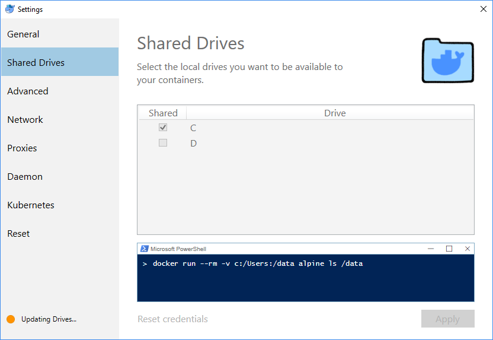

# Descriptions
This is an easy to configure development environment to play around with Hyperledger Indy. Files can be written in an IDE or text editor like VSCode on the host machine, while being able to have a consistent docker environment to run files in a simple way. It uses docker and docker images that are pre-configured to setup a pool (indy_pool) and a Indy development environment (indy_dev) and allow the devlopment environment to interact with the pool of indy_nodes. This is not intended to allow for indy-plenum, plenum-plugin, or  indy-node development. If you'd like to do that, check out sovrin's [token-plugin](https://github.com/sovrin-foundation/token-plugin#org003878b) repository.


# Setup

## Prerequisites
1. [Docker](https://docs.docker.com/install/#supported-platforms)
2. Make for [Mac](https://stackoverflow.com/questions/10265742/how-to-install-make-and-gcc-on-a-mac#10265766) or [Debian Linux](https://stackoverflow.com/questions/11934997/how-to-install-make-in-ubuntu#11935185)

## In-Browser

With the in-browser setup, we'll be using a docker lab hosted by docker to setup a docker container and then build docker containers inside of it. It's a nice way to easily get setup and try out Hyperledger Indy SDK. 

**Note this is a temporary environment and should only be used to play around with the preconfigured guides.**

If you do not have a account on [docker hub](https://hub.docker.com) signup for one now. You'll need it to proceed with the in-browser experience.

1. Once you've setup an account go to labs.play-with-docker.com and **sign in** using your docker hub account.
2. Now, Click the **Start** button, available after signing in.
3. Once you're in here, you should see a **+ ADD NEW INSTANCE** button on the left side.
4. Inside of this terminal run `git clone https://github.com/kdenhartog/indy-dev.git`

you now can run the commands available in the Unix systems section below.

## Unix systems

setup docker first and start the docker Daemon

then clone this repository and `cd indy-dev` 

First we'll need to build the environment. To build the indy_pool and indy_dev images run: `sudo make build`

Next, we'll start up the pool and the dev environment in the current working directory run: `sudo make start`

to stop the docker containers, first exit the indy_dev container with `exit` and then run: `sudo make stop`

to cleanup the docker images built run: `sudo make cleanup`

to refresh the container and cleanup the data in the wallets and the pool.txn file use `sudo make refresh`

## Windows
The steps below have been tested with Windows 10 Professional but the following previous caveat still applies: Your mileage may vary on Windows and will be tougher to work with, continue at your own risk.

Alternatively, if you've not been able to get docker setup on windows, **Use the in-browser setup instead.**

### Assumptions
1. You want to clone (download) the `indy-dev` project into a folder called `C:\INDY\indy-dev`. If you prefer a top-level folder that is different from `C:\INDY`, this is a safe and easy change to make.
2. Docker Desktop for Windows 10 Version 2.0.0.0-win81 (29211) or greater is installed on your Windows 10 computer.
3. Docker Desktop is configured to use Linux containers (and not Windows containers).
4. The following steps do not assume or require that you have installed the Windows 10 Linux subsystem feature installed on your Windows 10 computer.
5. The following steps assume you have used the Docker Desktop app to share your C: (or alternate drive partitiion) with a Linux container. 
   - Start the Docker Desktop app by clicking the Docker icon in the Task Bar System Tray.
   - Click Settings
   - Select Share Drives
   - Select C: (or an alternate drive)
   - Click Apply
   - When prompted, enter your local Windows 10 login credentials to enable Docker to create a shared drive.
   
6. Enter the following series of commands:
```
c:
mkdir c:\INDY
git clone https://github.com/kdenhartog/indy-dev.git

cd  c:\INDY\indy-dev
docker build -f indy-pool.dockerfile -t indy_pool .
docker build -f indy-dev.dockerfile -t indy_dev .
docker run -itd --net=host -p 127.0.0.1:9701-9708:9701-9708 indy_pool
docker run -it --net=host -p 127.0.0.1:8080:8080 -v C:/INDY/indy-dev:/indy-dev indy_dev
```
NOTE: The construction `C:/INDY/indy-dev:/indy-dev` is necessary under Windows 10 because if the `:/indy-dev` alias is missing, you end up with an unusable shared folder called `C:/INDY/indy-dev` in your Linux session.

REFERENCE:  https://forums.docker.com/t/volume-mounts-in-windows-does-not-work/10693/7

## Test Python environment
Once inside the docker shell (started in step 2 of "how to start"):

```
cd python
python3 getting_started.py
```

If the getting started guide completes through the end of cleanup everything is working correctly.

## Going through the IndySDK How-to guides

Details to be added shortly

## Advanced Usage

After you've gotten a chance to build the environment and go through the getting started guide then you're ready to start building a basic project using the IndySDK. On your host machine, get the full working directory of your project (usually with `pwd`) and pass that in as a value to the *DIR* variable when starting the dev environment.
 
As an example: ` make start DIR=/home/user/example/project/`

## improvement plans
* Add fix for browser support
* Finish DID-Auth Python example
* Add Node.js wrapper support (help wanted)
* Add Java wrapper support (help wanted)
* Add .net wrapper support (help wanted)
* Add Objective C wrapper support (help wanted)
* Add support for different versions of SDKs

## Makefile issues?
```
cd scripts
chmod +x *.sh
```

